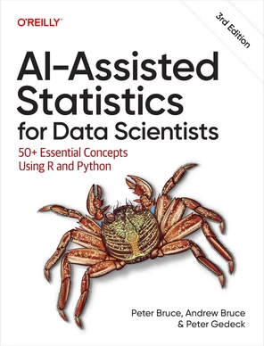

[](https://www.python.org/downloads/)

# AI-Assisted Statistics for Data Scientists
Code repository for O'Reilly book


# Code repository
<table width='100%'>
 <tr>
  <td></td>
  <td>
   <p><b>AI-Assisted Statistics for Data Scientists:</b></p>

   <p>50+ Essential Concepts Using R and Python<br>
by Peter Bruce, Andrew Bruce, and <a href="https://www.amazon.com/Peter-Gedeck/e/B082BJZJKX/">Peter Gedeck</a></p>

   <ul>
    <li>Publisher: <a href="https://learning.oreilly.com/library/view/ai-assisted-statistics-for/0642572242435/">O'Reilly Media</a>; 3rd edition, early release (March, 2026)</li>
   <li>ISBN-13: 979-8341666283</li>
    <li>Buy on 
     <a href="https://www.amazon.com/AI-Assisted-Statistics-Data-Scientists-Essential/dp/B0GK713BRM/">Amazon</a></li>
   <li>Errata: <a href="http://oreilly.com/catalog/errata.csp?isbn=0642572242428">http://oreilly.com/catalog/errata.csp?isbn=0642572242428</a></li>
   </ul>
    </td>
  </tr>
</table>


<!-- 
## Other language versions
<table>
  <tr>
    <td></td>
    <td><b>English:</b><br>
     Practical Statistics for Data Scientists: 50+ Essential Concepts Using R and Python<br>
     2020: ISBN 149207294X<br>
     <a href='https://www.google.com/books/edition/Practical_Statistics_for_Data_Scientists/F2bcDwAAQBAJ?hl=en'>Google books</a>,
     <a href="https://www.amazon.com/Practical-Statistics-Data-Scientists-Essential/dp/149207294X?&_encoding=UTF8&tag=petergedeck-20&linkCode=ur2&linkId=01266bb457a44268bc7efdb80d6c7312&camp=1789&creative=9325">Amazon</a>
    </td>
  </tr>
</table> -->


## See also
Code repositories for first and second edition:
- First edition: <a href="https://github.com/andrewgbruce/statistics-for-data-scientists">https://github.com/andrewgbruce/statistics-for-data-scientists</a>
- Second edition: <a href="https://github.com/gedeck/practical-statistics-for-data-scientists">https://github.com/gedeck/practical-statistics-for-data-scientists</a>


<!--
# Setup of R and Python environments

We recommend using a conda environment to run the Python and R code.

```
conda create -n asda # Create the conda environment named asda.
conda activate asda # Activate the environment we created.
conda env update -n asda -f environment.yml # Update the R environment from the environment.yml file
pip install -r requirements.txt  # Installs all required Python dependencies
```

The full list of Python and R dependencies from the [environment.yml](environment.yml) file:
-->
