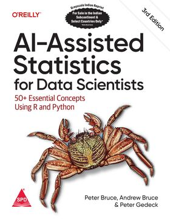

[](https://www.python.org/downloads/)

<!-- # AI-Assisted Statistics for Data Scientists
Code repository for O'Reilly book -->


<!-- # Code repository -->
<table width='100%'>
 <tr>
  <td></td>
  <td>
   <p><b>AI-Assisted Statistics for Data Scientists:</b></p>

   <p>50+ Essential Concepts Using R and Python<br>
by Peter Bruce, Andrew Bruce, and <a href="https://www.amazon.com/Peter-Gedeck/e/B082BJZJKX/">Peter Gedeck</a></p>

   <ul>
    <li>Publisher: <a href="https://learning.oreilly.com/library/view/ai-assisted-statistics-for/0642572242435/">O'Reilly Media</a>; 3rd edition (June, 2026)</li>
   <li>ISBN-13: 979-8341666283</li>
    <li>Buy on 
     <a href="https://www.amazon.com/AI-Assisted-Statistics-Data-Scientists-Essential/dp/B0GK713BRM/">Amazon</a></li>
   <li>Errata: <a href="http://oreilly.com/catalog/errata.csp?isbn=0642572242428">http://oreilly.com/catalog/errata.csp?isbn=0642572242428</a></li>
   </ul>
    </td>
  </tr>
</table>

# Table of Content

1. Exploratory Data Analysis
2. Data and Sampling Distributions
3. Statistical Experiments and Significance Testing
4. Regression and Prediction
5. Classification
6. Statistical Machine Learning
7. Unsupervised Learning
8. Neural Networks
9. Deep Learning
10. Generative AI and Large Language Models (LLMs)
11. Caveats and Concerns


# Code Documentation
The R and Python source code from the book is available as browsable and searchable webpages containing all code, output, and figures from the book.

- [R code](https://gedeck.github.io/ai-assisted-statistics-for-data-scientists/docs/R/)
- [Python code](https://gedeck.github.io/ai-assisted-statistics-for-data-scientists/docs/python/)


# Download
Download the data and source code as ZIP archives:

- [data.zip](code/data.zip) — the data files used throughout the book
- [python.zip](code/python.zip) — the Python source code
- [R.zip](code/R.zip) — the R source code


# Other language versions
<table>
  <tr>
    <td></td>
    <td>English (Indian subcontinent &amp; select countries only):<br>
     AI-Assisted Statistics for Data Scientists: 50+ Essential Concepts Using R And Python, Third Edition<br>
     2021: ISBN 978-9-368-08069-5, Shroff Publishers and Distributors Pvt. Ltd.
     <br>
     <!-- <a href='https://www.google.com/books/edition/'>Google books</a>, -->
     <a href='https://www.shroffpublishers.com/books/9789368080695/'>Order here</a>
    </td>
  </tr>
</table>


## See also
Code repositories for first and second edition:
- First edition: <a href="https://github.com/andrewgbruce/statistics-for-data-scientists">https://github.com/andrewgbruce/statistics-for-data-scientists</a>
- Second edition: <a href="https://github.com/gedeck/practical-statistics-for-data-scientists">https://github.com/gedeck/practical-statistics-for-data-scientists</a>


<!--
# Setup of R and Python environments

We recommend using a conda environment to run the Python and R code.

```
conda create -n asda # Create the conda environment named asda.
conda activate asda # Activate the environment we created.
conda env update -n asda -f environment.yml # Update the R environment from the environment.yml file
pip install -r requirements.txt  # Installs all required Python dependencies
```

The full list of Python and R dependencies from the [environment.yml](environment.yml) file:
-->
